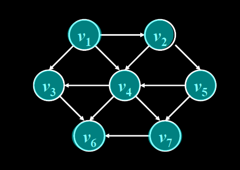

                                    *基本定义*

<font color='yellow'>数据结构</font>是带有结构的数据元素的集合

<font color='yellow'>数据项</font>是最小单位

<font color='yellow'>数据元素</font>可以是数据项的集合

<font color='yellow'>数据对象</font>是具有相同性质的数据元素的集合，是数据的一个子集	


<center><font size=6 color='gree'>数据项 < 数据元素 < 数据对象 < 数据</font></center>

​																		*数据结构定义*
$$
数据对象\begin
{cases}
物理结构\begin{cases}顺序\\链式
\end{cases}\\\\
逻辑结构\begin{cases}线性\\树\\图
\end{cases}
\end{cases}\\
抽象数字类型\begin{cases}
数据类型\begin{cases}
数据对象集\\相关联的操作集
\end{cases}\\\\抽象\begin{cases}
与数据存储的物理结构无关\\与算法和语言无关
\end{cases}
\end{cases}
$$
​																		*算法定义*
$$
算法\begin{cases}
一个有限的指令集\\接受输入\\产生输出\\有限\\不能有歧义
\end{cases}\\
特性\begin{cases}
正确性\\可读性\\健壮性\\高效性
\end{cases}\\
复杂度\left. \begin{cases}时间T(n)\\空间S(n)
\end{cases}\right\}取决于\begin{cases}输入\\问题规模\\算法本身
\end{cases}\\
$$

1.如果循环队列用大小为m的数组表示，队头位置为front，队列元素个数为size，那么队尾元素位置rear为 <font color='yellow'>(front+size)%m</font>

2.循环队列	满：<font color='yellow'>(rear+1)%MaxSize=front</font>

​					  空：<font color='yellow'>rear=front</font>

​                      元素个数：<font color="yellow">(rear-front+MaxSize)%MaxSize</font>

3.

**链表**


​										

​													**双向链表**<font color="yellow">(需要同时考虑前后两个指针)</font>


```C++
t->Previous = p;
t->Next = p->Next;
p->Next->Previous = t;
p->Next = t;
```


**P36 单链表逆转**


```C
List Reverse( List L ){
    PtrToNode Old_head, New_head, Temp;
	Old_head = L;    // 初始化当前旧表头为L
	New_head = NULL; // 初始化逆转后新表头为空
	while (Old_head){  // 当旧表不为空时
		Temp = Old_head->Next;
		Old_head->Next = New_head;  
		New_head = Old_head;  // 将当前旧表头逆转为新表头
		Old_head = Temp;     // 更新旧表头
	}
	L = New_head;  // 更新L
	return L;
}
```


**P49 快排划分思想求第K大数**

 ```C
 ElementType FindKthLargest(ElementType S[], int K, int Left, int Right){  // 在S[Left]...S[Right]中找第K大元素
     ElementType e = S[Left]; // 简单取首元素为基准
     int L = Left, R = Right;
     while(true){ // 将序列中比基准大的移到基准左边，小的移到右边
         while(Left <= Right && e <= S[Left]) Left++;
         while(Left < Right && e > S[Right]) Right--;
         if (Left < Right) swap(S[Left], S[Right]);
         else break;
     }
     swap(S[Left - 1], S[L]); // 将基准换到两集合之间 
     if (Left - L - 1 >= K) // (Left-L-1)代表了集合S1的大小 
         return FindKthLargest(S, K, L, Left - 2); // 在集合S1中找
     else if (Left - L - 1 < K - 1)
         return FindKthLargest(S, K-(Left-L-1)-1, Left, R); //在集合S2中找 
     else return e; // 找到，返回
 }
 ```

​															线性表的顺序存储实现(数组)
$$
\begin{array}{|c|c|c|}
\hline操作&注意&平均移动次数&时间复杂度\\
\hline插入&先移动再插入&\frac n2&O(n)\\
\hline删除&后面的元素依次前移&\frac{n-1}2&O(n)\\\hline
\end{array}
$$

​															

​																线性表的链式存储实现
$$
\begin{array}{|c|c|c|}
\hline操作&注意&平均移动/查找次数&时间复杂度\\
\hline求表长&p=p\rightarrow Next&&O(n)\\
\hline查找&按序号/值&&O(n)\\
\hline插入&无需移动(可带头结点)&\frac n2&O(n)\\
\hline删除&&\frac{n-1}2&O(n)\\\hline
\end{array}
$$
​	链式插入


```c
//不带头结点
tmp->Next = pre->Next;
pre->Next = tmp;

//带头结点
tmp = (Position)malloc(sizeof(struct LNode));
tmp->Data = X; 
tmp->Next = pre->Next;
pre->Next = tmp;
```


​	链式删除


```C
//默认带头结点
tmp = pre->Next;
pre->Next = tmp->Next;
free(tmp);
```


​																     **<font size=5>堆栈</font>**

栈的顺序存储(一维数组+记录<font color="yellow">栈顶</font>元素位置)

```c
typedef struct SNode *PtrtoSNode;
struct SNode{
    ElementType *Data;//存储元素的数组
    int top; //栈顶指针
    int MaxSize;
};
typedef PtrToNode Stack;
```

栈的操作

```c
//先判断满栈or空栈
void Push(Stack S, ElementType X){
    S->Data[++(S->Top)] = X;
}
ElementType Pop(Stack S){
    else return (S->Data[(S->Top)--]);
}
```


栈的链式存储(单链表，<font color="yellow">栈顶指针Top</font>为头指针)

```C
typedef struct SNode *PtrToSNode;
struct SNode{
	ElementType Data;   
    PtrToSNode Next;
};
typedef PtrToSNode Stack;
```

栈的操作

```C
//先判断满栈or空栈
void Push(Stack S, ElementType X){
	PtrToSNode TmpCell;
	TmpCell = (PtrToSNode)malloc(sizeof(struct SNode));
	TmpCell->Data = X;
	TmpCell->Next = S->Next;
	S->Next = TmpCell;
}
ElementType Pop(Stack S){
	PtrToSNode FirstCell;
	ElementType TopElem;
	else{
		FirstCell = S->Next; 
		TopElem = FirstCell->Data;
		S->Next = FirstCell->Next;
		free(FirstCell);
		return TopElem;
	}
}
```

​																			中缀$\rightarrow$后缀：
$$
\begin{array}{|c|c|}
\hline 运算数&输出\\\hline
左括号&压栈\\\hline
右括号&弹出运算符并输出(左括号弹出不输出)\\\hline
运算符&优先级\begin{cases}大于栈顶运算符：压栈\\小于栈顶运算符：弹出栈顶运算符并输出\rightarrow move\ on
\end{cases}\\\hline
处理完毕&存留运算符一并输出\\\hline
\end{array}\\
$$
​													

​													                           **<font size=5>队列</font>**

队列的顺序存储

```C
typedef struct QNode *PtrtoQNode;
struct QNode{
    ElementType *Data;
    int Front, Rear; //头尾指针
    int MaxSize;
};
typedef PtrtoQNode Queue;
```

​																		循环队列
$$
\begin{array}{|c|c|}
\hline队满条件&(Rear+1)\%MaxSize=Front\\\hline
队空条件&Rear=Front\\\hline
元素个数&(Rear-Front+MaxSize)\%MaxSize\\\hline
\end{array}\\
$$


​																					**<font size=7>树</font>**

树的遍历（先序、中序、后序）

二叉树的深度$\leq$结点数N，平均深度为$O(\sqrt N)$

完全二叉树适合<font color='yellow'>顺序</font>存储结构
$$
\begin{array}{|c|c|}
\hline第i层最大结点数&2^{i-1}\\\hline
深度为k的二叉树最大结点总数&2^k-1\\\hline
完全二叉树结点序号&\begin{cases}父结点:\lfloor i/2\rfloor\\左孩子:2i\\右孩子:2i+1 \end{cases}\\\hline
\end{array}\\
$$
FirstChild-NextSibling表示法转$45^\circ$为二叉树

<font size=5>**二叉搜索树(Binary Search Tree)**</font>
$$
要求\begin{cases}
左子树<根结点\\
右子树>根结点\\
左右子树均为BST树
\end{cases}\\
查找效率取决于树的高度\\
\begin{array}{|c|c|}
\hline插入&Find位置，插入\\\hline
删除&\begin{cases}
叶结点：直接删除，修改父结点指针\\一孩子结点：删除前将父结点指针指向删除的孩子结点\\
二孩子结点：取左树最大或右树最小替代删除元素\\
\end{cases}\\\hline
\end{array}
$$

<font size=5>**平衡二叉树(AVL)**</font>
$$
要求\begin{cases}
非空BST\\
任意结点左右子树高度差=平衡因子\leq 1\\
查找时间性能为O(logN)\\
\end{cases}
$$


$\uparrow$左子树的右子树的根节点作为调整后的根节点


$\uparrow$右子树的左子树的根节点作为调整后的根节点

<font size=5>**堆(小顶堆)**</font>

构造原则：从上到下，从左至右，结点小于左右孩子

<font size=5>**Huffman**</font>

 带权路径最小的二叉树为<font color='yellow'>最优二叉树</font>or<font color='yellow'>霍夫曼树</font>，整体复杂度为$O(n\log n)$
$$
特点\begin{cases}没有度为1的结点\\n个叶子结点霍夫曼树共有2n-1个结点\\非叶结点的左右子树交换后仍是霍夫曼树\\对一组权值，存在不同构的两课霍夫曼树
\end{cases}\\
$$
Huffman编码：


<font size=5>**并查集**</font>

并运算之后的集合:

​						实现S1$\cup$S2    （3是1的子结点）

简单合并		按秩合并

路径压缩

由3到根结点4的所有路径结点均为根结点4的子结点

**<font size=7>Hash表</font>**

时间复杂度为$O(1)$
$$
常用Hash函数\begin{cases}数字关键词\begin{cases}
直接定址\\除留余数\\数字分析\\折叠(h(56793542)=056+793+542)\\平方取中间几位
\end{cases}\\字符关键词\begin{cases}
ASCll码加和\\前3个字符移位\\
\end{cases}\end{cases}\\
$$
<font size=5>处理冲突的方法：</font>

>1.开放定址法
>$$
>\begin{array}{|c|c|}\hline
>线性探测&d_i=+i\\\hline平方探测&d_i=\pm i^2\\\hline双散列&d_i=i\times h_2(key)\\\hline
>\end{array}\\
>$$
>如果散列长度TableSize=4k+3形式的素数，平方探测可以探查到整体散列表空间
>
>ASL u(到第一个关键字为空的地址需要比较的次数)
>
>2.链地址法：有相同哈希值的数据通过结点存储在链表中

$$
性能分析\begin{cases}Hash函数是否均匀\\处理冲突的办法\\装填因子\alpha
\end{cases}
$$

<font size=7>**图**</font>
$$
无向完全图：边数=\frac{n(n-1)}2\\
有向完全图：边数=n(n-1)\\
生成树：包含所有顶点的极小连通子图\\
$$
​    图的存储：邻接矩阵(直观、浪费空间)&邻接表(节省空间、不便检查两点间是否有边)

​    图的遍历（BFS&DFS）

$$
最小生成树\\\begin{array}{|c|c|}\hline
Prim&从一点出发，连接权值最小的点\\\hline
Kruskal&先写顶点，依次并入连通图中\\\hline
\end{array}
$$

​    	最短路径（Dijkstra）      $O(|V|)$


​													最短路径为$4\leftarrow5\leftarrow6\leftarrow7\leftarrow0$（回溯）

​    

​																			拓扑排序



没有边指向该点时删除该点以及其所连边，结果：$v_1\rightarrow v_2\rightarrow v_5\rightarrow v_4\rightarrow v_3\rightarrow v_7\rightarrow v_6$

​    <mark>关键路径</mark>

 

 

<font size=7>**排序**</font>
$$
\begin{array}{|c|c|c|c|c|}\hline
排序方法&平均时间复杂度&最坏情况时间复杂度&空间复杂度&稳定性\\\hline
选择排序&O(N^2)&O(N^2)&O(1)&不稳定\\\hline
插入排序&O(N^2)&O(N^2)&O(1)&稳定\\\hline
冒泡排序&O(N^2)&O(N^2)&O(1)&稳定\\\hline
希尔排序&O(N^d)_{(1<d<1.5)}&O(N^2)&O(1)&不稳定\\\hline
堆排序&O(NlogN)&O(NlogN)&O(1)&不稳定\\\hline
快速排序&O(NlogN)&O(N^2)&O(logN)&不稳定\\\hline
归并排序&O(NlogN)&O(NlogN)&O(N)&稳定\\\hline
基数排序&O(D(N+R))&O(D(N+R))&O(N+R)&稳定\\\hline
\end{array}
$$

$$
基数排序(桶排)\left. \begin{cases}
主位优先法\\次位优先法
\end{cases}\right\}分配\&收集
$$
